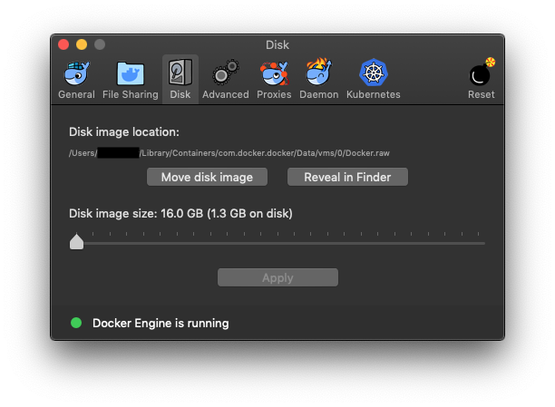

# Run Pihole locally on your Mac

Ads generate the revenue necessary for hosting content on the web and are a source of income that supports a lot of the developers. This seems innocuous at first however, when you think that a majority of these ads are used for tracking your web activity and in future are used in serving you even more advertisments tailored to you. It sounds diabolical, but this is the harsh reality of the web we use, and it was certainly something I did not want to participate in like many others. 

Therefore, I got inspired by a [Reddit thread](https://www.reddit.com/r/pihole/comments/9k6lzp/run_pihole_on_macos_mojave_with_docker/) from the user [/u/dudutwizer](https://www.reddit.com/user/dudutwizer/) and installed [pihole](https://pi-hole.net) inside a [Docker](https://en.wikipedia.org/wiki/Docker_(software)) container on my iMac running MacOS Mojave. This method should work on all devices running MacOS.

## 1. Install Docker on your Mac
A. Register for a free [dockerhub](https://hub.docker.com/signup) account if you don't have one already.
B. Download and install [Docker for Mac](https://hub.docker.com/editions/community/docker-ce-desktop-mac).

Run docker for mac after installation, and wait for it to initialize. Change these two settings:

**A.** Reduce the size docker occupies on disk: 

Since this could be an issue on Macbook devices where storage is very limited. 

Docker → Preferences → Disk : And reduce it to 16Gb like below:



When this documentation is written 16GB is the lowest posible value on Docker Version 2.0.0.3 (31259). You need ≈ 1.5 of space to get it up and running.

**B.** Reduce the CPU, RAM and Swap like this:


Pihole is not that resource hungry, it can even run on a [raspberry pi zero](https://www.raspberrypi.org/products/raspberry-pi-zero/). But, these are the minimum possible values that a user can allocate toDocker [Version 2.0.0.3 (31259)].

**Note:** Despite reducing the RAM to 1GB and swap to 512MB, you will still notice docker using ≈ 1.7GB of RAM on checking the Activity Monitor. 

On digging further you will find that the pihole container uses < 450MB RAM. So what happens to all the extra RAM? I don’t have answers. This is a known issue (e.g. [Issue 3232](https://github.com/docker/for-mac/issues/3232), [Issue 3304](https://github.com/docker/for-mac/issues/3304)) with com.docker.hyperkit, and all we can do is hope that Docker team works closely with Hyperkit to resolve it.

## 2. Install Pihole.
Open terminal and run

```sh
docker pull pihole/pihole
```

## 3. Find your local IP address:

#### Using CUI

In a terminal run the following command

```sh
ifconfig en0
```
And then the IP address will be visible as in the field marked with a red arrow the screenshot below.


#### Using GUI

Go to:   → System Preferences → Network → chose your primary interface (Ethernet or Wireless). You will have your IP address listed in the two places, as marked by red arrows in the screenshot below.
  


## 3. Execute docker. Fill in your IP and a password :

Run Docker (fill in IP to your local IP and Password to your password.)
The ```docker run``` command below uses[Cloudflare DNS](https://1.1.1.1/dns/), but you can use any of the available [public dns resolvers](https://en.wikipedia.org/wiki/Public_recursive_name_server), [public DNS resolvers hosted by individuals](https://public-dns.info/), or even your self-hoster DNS resolvers as the Upstream DNS resolver for pihole. 
If you want you can use [DNSSpeedTester](https://github.com/robocopAlpha/DNSSpeedTester), my R script, to compare the latency and performance of different DNS resolvers from your location and pick the that is best for you. Cloudflare was the fastest for my location; YMMV.

```sh
# Minimal command
docker run -d --name pihole -e ServerIP=YourIP -e WEBPASSWORD="YourPassword" -e DNS1=1.1.1.1 -p 80:80 -p 53:53/tcp -p 53:53/udp -p 443:443 pihole/pihole:latest

# Recommended command
docker run -d --name pihole -e ServerIP=192.168.0.10 -e TZ=Europe/Helsinki -e WEBPASSWORD=SecretAgent007 -e DNS1=1.1.1.1 -e DNS2=1.0.0.1 -p 80:80 -p 53:53/tcp -p 53:53/udp -p 443:443 -v ~/pihole/:/etc/pihole/ --dns=127.0.0.1 --dns=1.1.1.1 --cap-add=NET_ADMIN --restart=unless-stopped pihole/pihole:latest
```
The ```--restart=unless-stopped``` parameter ensures that pihole starts up when your mac reboots, provided you did not stop pihole manually.

If you ever wish to change the ```WEBPASSWORD``` you specfied above (since the above command will stay readable in your shell’s history) you can also run :
```sh
docker exec -it pihole pihole -a -p new_password
# Or
docker exec -it pihole /bin/bash
pihole -a -p
# Now you can set a new password
```


## 4. Check if pihole is running
```sh
docker ps # should list the pihole container

docker exec pihole pihole status
```

## 5. Change the DNS on your network interface to your pihole : 

Now that pihole is up and running, we can use it to filter and resolve DNS queries.

#### CUI

```sh
networksetup -setdnsservers Ethernet 127.0.0.1
networksetup -setdnsservers WiFi 127.0.0.1
```

#### GUI

You can change your DNS server by going to:

 → System Preferences → Network → Ethernet (and/or WiFi) → Advanced → DNS → Keep a note of your default DNS Servers (if any) and overwrite it with 127.0.0.1. 

It should look like the following image:


**Note:** Remember to remove other DNS servers (if any), i.e. you should have only 127.0.0.1 as your DNS server.

## 6. Check if pihole is working:

Run the following command on a terminal to make sure your DNS queries are actually going to the pihole:

```sh
dig google.com +noall +stats +answer
# OR
nslookup google.com
```


If everything is configured correctly, your DNS server should turn out to be 127.0.0.1, from either of these two commands.

Now, open a webbrowser and open http://pi.hole/ or http://127.0.0.1/admin → *Click* ‘Login' *from the left panel*.

You should now see the pi-hole web interface. 

Go to a few ***ad-infested websites*** and check if pihole is working or not. Two things should happen:

A. You should not see any advertisements or trackers.

B. On refreshing your pihole interface, you should see the **“Queries Blocked”** and **“Percent blocked”** go up. Something like this (*the following screenshot is after 30 minutes of extensive testing, for demonstration purposes, therefore there are so many queries*):


The default blocklists are a very good place to start, but there are plenty other places where you can explore and add additional blocklists from. 


## To modify blocklists:

If you want to add the blocklists the PiHole Web admin interface (http://127.0.0.1/admin) → Settings → Blocklists → Enter the URL for a blocklist you wish to add.

From the same place you can remove or temporarily turn off (until further notice) the blocklists, like the following image:


Remember to click “**Save and Update**” on bottom right side below the “*Enter URL*” text box. This actually allows pihole to consolidate all of your blocklists (remove duplicates) into a single file and use that as the filter.

**Note:** The blocklists are a dynamic ecosystem requiring reqular addition of new domains and removal of dead domains to keep the blocklist in good "health".

Some blocklists you can investigate are:

1. [https://dbl.oisd.nl](https://dbl.oisd.nl/) from this [reddit thread](https://www.reddit.com/r/pihole/comments/bppug1/introducing_the/) and user [Stephan (/u/sjhgvr)](https://www.reddit.com/user/sjhgvr/)
2. Several blocklists by [jmdugan on github](https://github.com/jmdugan/blocklists/tree/master/corporations) for google, facebook, etc. 
3. Google/Duckduckgo/Startpage “pihole blocklists”. As I said earlier, blocklists are dynamic, if the maintainer loses interest, or lacks time in blocklist, they will go stale and hopefully better one’s will be available on the web.


# Miscellaneous info:

## To stop running pihole:

In case pihole starts to malfunction and you need to take it down for maintainence or if you wish to turn off pihole all together you need to run: 

```sh
docker stop pihole
```

Your “internet won’t work” until you run pihole again. 

To go online without pihole: 

You need to change the DNS server of your Ethernet or WiFi network adapter to a “working DNS” since you pihole is offline. You can do so by:

 → System Preferences → Network → Ethernet (and/or WiFi) → Advanced → DNS → add 1.1.1.1 (cloudflare) or 8.8.8.8 (google) OR run ```networksetup -setdnsservers Ethernet 1.1.1.1``` on a terminal.


## To remove/uninstall the container for pihole:

In case you wish to remove pihole for some reason and start from scratch:

```sh
# Stop the container
docker stop pihole

# This command passes the container id for "pihole" as an argument to the docker remove command
docker container rm $(docker container ls -a | rg "pihole" | awk '{ print $1 }')
```

You will still have your configs and blocklists saved in your ```~/pihole```, if you defined a volume using ```-v ~/pihole/:/etc/pihole/``` parameter while running the container.


## Log into pihole docker's bash shell:

If you wish to access and maintain pihole through the command line you can enter the pihole docker container’s bash shell (the container doesn’t have zsh, the last time I checked):

**The following command logs you in as root for the pihole docker container. **
**Be very cautious of the commands you run.**

More commands for controling and monitoring pihole can be found at [docs.pi-hole.net](https://docs.pi-hole.net/core/pihole-command/) and more at [Pihole discourse](https://discourse.pi-hole.net/t/the-pihole-command-with-examples/738).

```sh
docker exec -it pihole /bin/bash
# Now you should be logged in as root in bash shell for the pihole docker

# You can run pihole commands like
pihole -c
# This should bring up the chronometer summary from pihole
```

This is how the chronometer looks like:


## Need verbosity than ```pihole -c```, Enter ```padd``` !!

For a more verbose version of the chronometer, I use [PADD](https://github.com/jpmck/PADD) from github user [jpmck](https://github.com/jpmck/).

PADD stands for Pi-hole® Ad Detection Display. To run and install you need to enter the following commands on a terminal:

```sh
docker exec -it pihole /bin/bash # logs you in as root to your pihole container

wget -N https://raw.githubusercontent.com/jpmck/PADD/master/padd.sh
sudo mv padd.sh padd
chmod 755 padd
sudo mv padd /usr/bin/padd

cp padd /etc/pihole/padd # You can run this command to keep padd on your ~/pihole in case you decide to re-install pihole. Note: This only works if you used the -v ~/pihole/:/etc/pihole/ parameter while running the pihole docker. )

# now you can execute PADD from anywhere by running
padd
```

PADD looks like this:


## Enable DNSSEC

To completely secure your DNS traffic, DNSSEC is not the optimal step (due to [issues](https://github.com/pi-hole/pi-hole/issues/2658)), but generally speaking, it is a step in the right direction.

And, it’s very simple to enable on a pihole:

Log in as admin to your pihole (http://127.0.0.1/admin) → Settings → DNS → Scroll all the way to the botton → *Mark the check box saying* "Use DNSSEC” → *Click the* “Save” *button (bottom right)*.

Test if your pihole has a working DNSSEC by using this [DNSSEC resolver test](http://dnssec.vs.uni-due.de).

Also it is possible to run PADD and check if DNSSEC is enabled. 


**Note:** To really secure your DNS requests an ideal approach would be to set up and use [DNS over HTTPS](https://docs.pi-hole.net/guides/dns-over-https/) with pihole. 